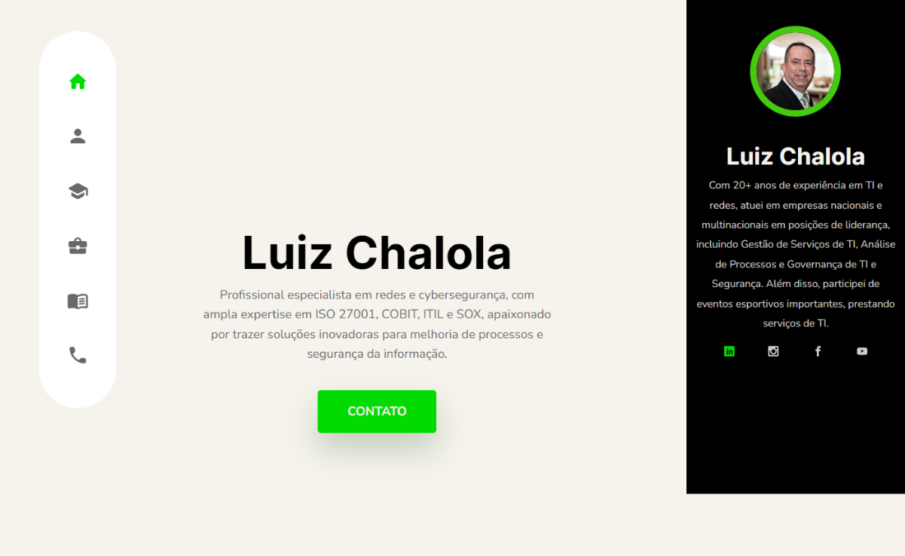

# Landing Page para Luiz Chalola - Cibersegurança

Este repositório contém o código fonte de uma landing page para Luiz Chalola, um profissional especializado em Cibersegurança. O projeto foi criado utilizando um template Bootstrap customizado por mim, Simone Penido.

## Visão Geral

A landing page foi projetada para apresentar os serviços oferecidos por Luiz Chalola, destacando suas habilidades e experiência na área de Cibersegurança. O objetivo é fornecer uma interface atraente e funcional que facilite o contato de clientes potenciais.

## Link para Visualização

A landing page está disponível para visualização no seguinte link:
[https://luizchalola.netlify.app](https://luizchalola.netlify.app)

## Tecnologias Utilizadas

- **HTML5**: Para a estruturação do conteúdo.
- **CSS3**: Para estilização e layout.
- **Bootstrap**: Para componentes responsivos e design moderno.
- **JavaScript**: Para interatividade e funcionalidades dinâmicas.

## Estrutura do Projeto

A estrutura do projeto está organizada da seguinte forma:

## Funcionalidades

- **Layout Responsivo**: Adaptável a diferentes dispositivos e tamanhos de tela.
- **Seções Informativas**: Inclui seções como Sobre, Serviços, Depoimentos, e Contato.
- **Formulário de Contato**: Permite que os visitantes entrem em contato diretamente através da página.

## Como Executar Localmente

1. Clone este repositório:
    ```bash
    git clone https://github.com/SimonePenido/Luiz_Chalola.git
    ```

2. Navegue até o diretório do projeto:
    ```bash
    cd Luiz_Chalola
    ```

3. Abra o arquivo `index.html` no seu navegador preferido.

## Contribuição

Se desejar contribuir para este projeto, por favor siga os passos abaixo:

1. Faça um fork do projeto.
2. Crie uma branch para sua feature (`git checkout -b feature/nova-feature`).
3. Commit suas alterações (`git commit -m 'Adiciona nova feature'`).
4. Faça o push para a branch (`git push origin feature/nova-feature`).
5. Abra um Pull Request.

---

Desenvolvido por [Simone Penido](https://github.com/SimonePenido).


CREDITS & REFERENCES

https://getbootstrap.com/

Template
https://templatesjungle.com/

Stock Photos
https://unsplash.com/
https://www.freepik.com/
https://www.pexels.com/

Fonts
Google fonts
https://fonts.google.com/

Icons
https://iconify.design/

JQuery Plugins
Swiper Slider - https://swiperjs.com/
AOS - https://michalsnik.github.io/aos/


